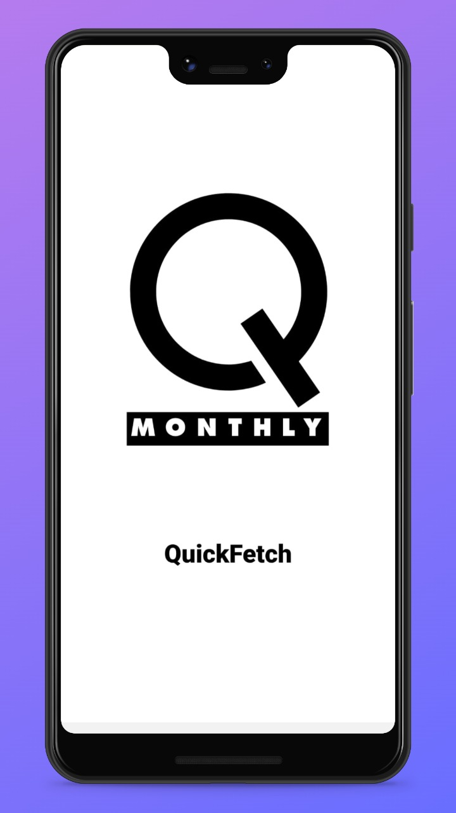
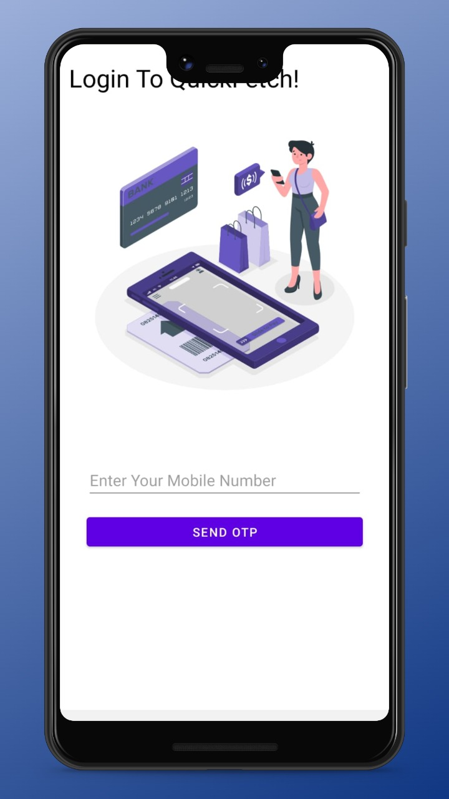
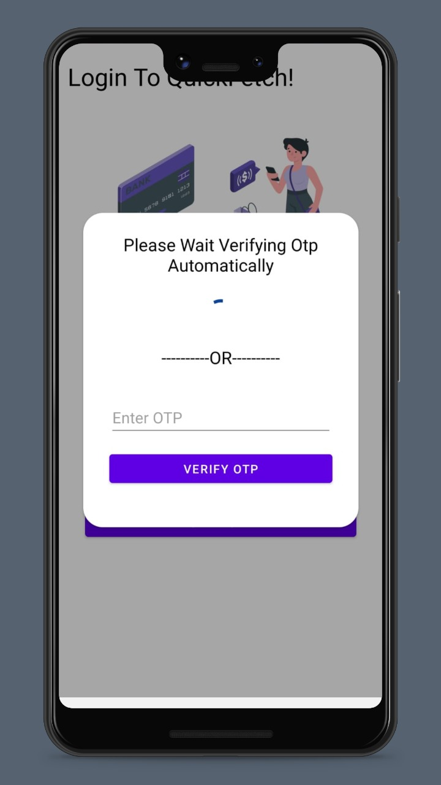
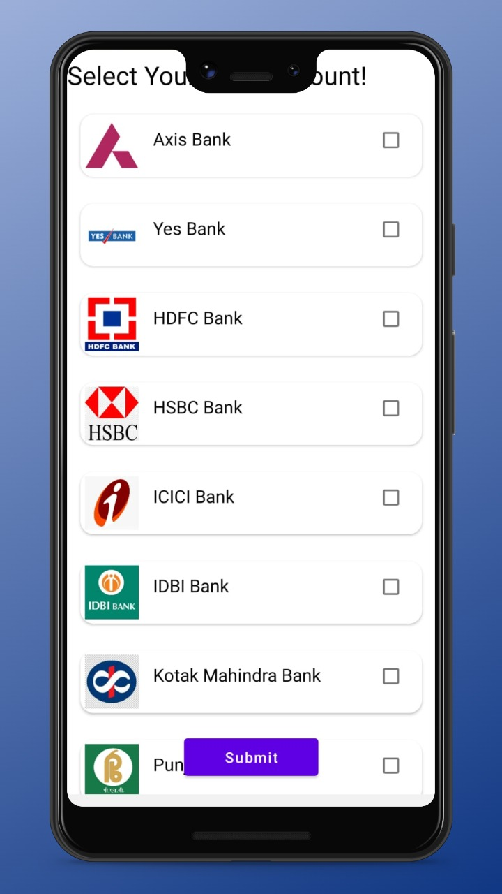
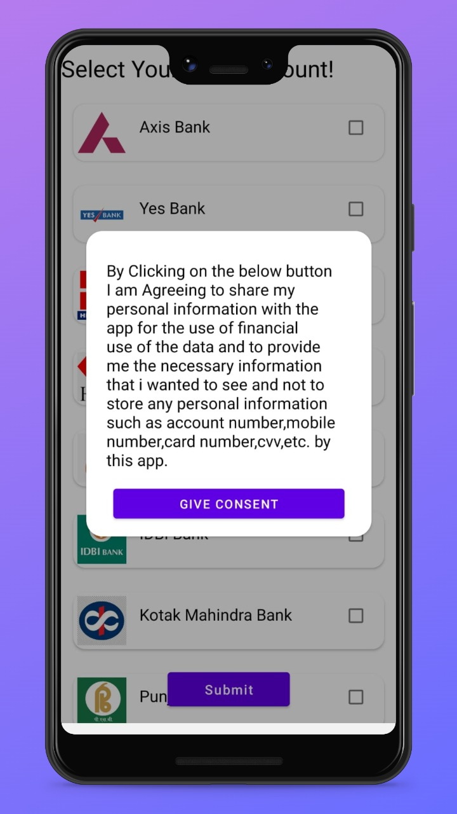
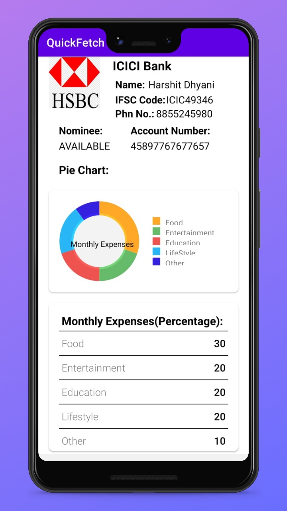

# QuickFetch

It is an Android app which is used to track your expenses and keep whole record of your bank account, so you don't need to carry any bank passbook.
The app secures your data that's why we use OTP method to login the app and the app verify the OTP automatically.
Before fetching the data we take the user's consent request to fetch their data from the server. User has both the options either to reject or accept the request.

After fetching the data, app provides the list of banks and select the bank in which you have your account and then the app request you to give the consent, after 
validating the consent the app fetch the account details like Name,Account Number, Branch IFSC code, Phone no., Nominee Availability and beautiful pie chart of your
account expenses which we divide it into five categories Food, Entertainment, Education, Lifestyle and Other. 
The app also provides your expenses in the form of percentage(%) data so that you can easily track how of your earnings/savings debited on these categories.

Features of this App:
1) Automatic Otp Verification
2) Take Consent from the User to Fetch Details
3) Show Information along with pie chart of your monthly expenses

